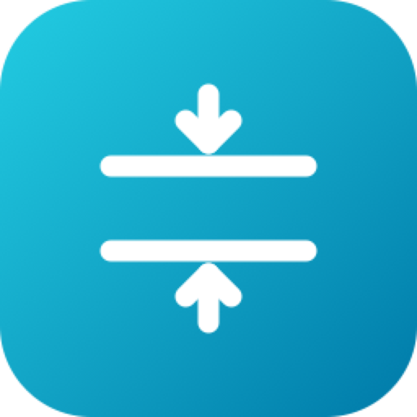
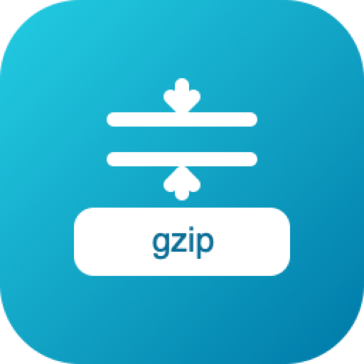
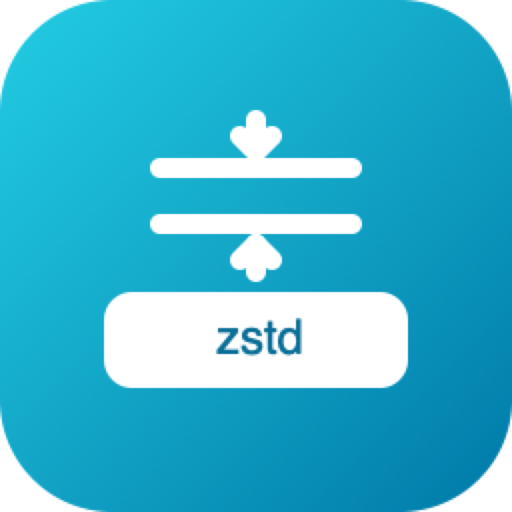

# go-compressions — brand assets

Official logos for the **go-compressions** organization.

## Formats

- **SVG** — `svg/color`, `svg/white` (white, transparent), `svg/black` (black, transparent)
- **PNG** 16→1024 px, 3 variants — `png/<variant>/<size>/`
- **JPG** (color, white background) — `jpg/<size>/`
- **ICO** (Windows) — `ico/`
- **ICNS** (macOS) — `icns/`
- **GitHub avatar** 512 px — `avatar/`

## Repos (10)

| | repo |
|---|---|
|  | `brotli` |
|  | `bzip2` |
|  | `deflate` |
|  | `gzip` |
|  | `lz4` |
|  | `lzma` |
|  | `snappy` |
|  | `xz` |
|  | `zlib` |
|  | `zstd` |

---
*Auto-generated assets — rounded square badge, line glyph, color / white / black variants.*
